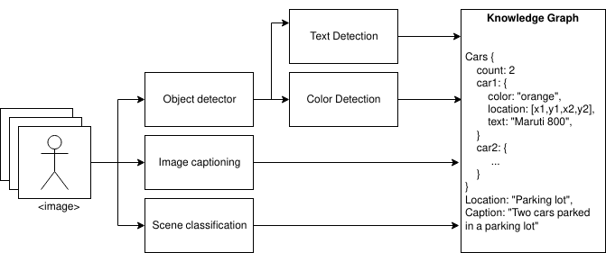
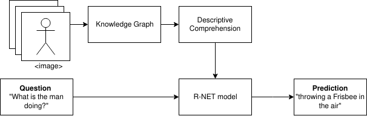
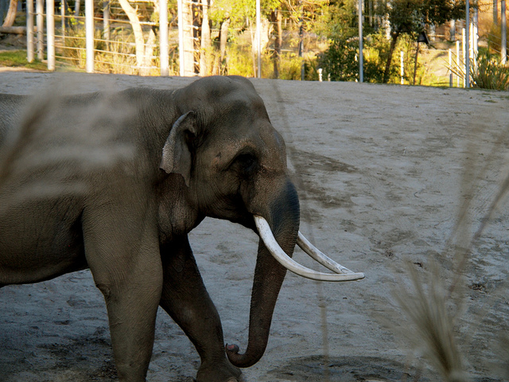
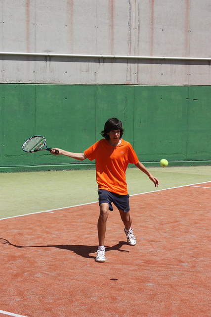

# VQA
The project aims at multi-layered understanding of pictures to allow a multi-perspective study and hence engender a visual question answering system.

## About
Visual Question Answering uses various machine learning techniques to answer questions about images. It is a two-part process. The first part requires us to analyze a given image and find out attributes. These attributes are stored as a knowledge graph. The figure below shows how an image is passed through various modules and a knowledge graph is generated.

The second part involves creating a descriptive comprehension from the knowledge graph using basic English syntax. This can be seen in the [paragraph_generator](./modules/paragraph_generator.py) module. Using [DeepPavlov](http://docs.deeppavlov.ai/en/master/features/models/squad.html), we then run a pre-trained model to determine answers to the questions asked by users.

## Results

Here are some examples of what our system is capable of -

input|question|answer
--- | --- | ---
|How many people are there?|4
|Where is this image taken?|Corral
|What color is the person wearing?|Orange
|What is the man doing?|Throwing a frisbee in the air

## Structure of the project
- The **data** directory contains pre-trained models and weights;
- The **modules** directory contains files for individual detection and classification tasks;
- The **utils** directory contains utilty and helper functions.
- The **DeepRNN** directory contains scripts required for image_captioning from DeepRNN.

## Setup
**Python** 3 is required.
- Clone the repository -

`git lfs clone --recurse-submodules https://github.com/shubham1172/VQA.git`

- Install the dependencies -

`pip install -r requirements.txt`

## Usage

`python3 run.py --path path/to/image`

## Reference

Image captioning : [DeepRNN/image_captioning](https://github.com/DeepRNN/image_captioning)
